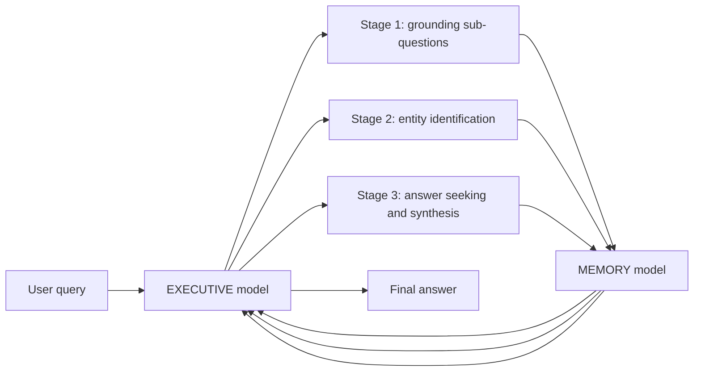

# MEMO: Full Paper Analysis

Paper PDF: [https://arxiv.org/pdf/2605.15156](https://arxiv.org/pdf/2605.15156)

## 1. What Problem Is the Paper Solving?

Large language models become stale after pretraining. They may not know new facts, private company data, newly published documents, or domain-specific corpora. The standard ways to add knowledge all have problems:

- **In-context learning (ICL)**: put documents in the prompt. This is simple, but expensive and limited by context windows.
- **Retrieval-augmented generation (RAG)**: retrieve chunks, then prompt the LLM. This scales better than ICL but is sensitive to bad retrieval and weak at multi-document synthesis.
- **Fine-tuning / continual pretraining**: update the LLM parameters. This can work, but is expensive, risks catastrophic forgetting, and usually cannot be done with closed-source models.
- **Latent memory methods**: compress knowledge into hidden states or soft tokens. These are compact, but usually coupled to one model family or tokenizer.

MEMO proposes a different design: train a separate **MEMORY model** on the target corpus, then let any frozen **EXECUTIVE model** query that MEMORY model in natural language.

The paper's core claim is that memory should be a model, not just a database.

## 2. The Main Idea

MEMO has three roles:

- **GENERATOR model**: used offline to convert a corpus into a large synthetic QA dataset.
- **MEMORY model**: trained on that QA dataset so the corpus becomes stored in its parameters.
- **EXECUTIVE model**: used at inference time to ask the MEMORY model targeted sub-questions and synthesize the final answer.

The EXECUTIVE model is never fine-tuned. It can be open-source or proprietary. The MEMORY model communicates through text, so it does not require shared hidden states, logits, tokenizers, or weights.

## 3. Why This Is Different From RAG

RAG retrieves documents or chunks at inference time. MEMO does not.

In RAG:

1. User asks a question.
2. Retriever searches the corpus.
3. Top chunks are pasted into the prompt.
4. LLM answers using those chunks.

In MEMO:

1. Offline, the corpus is converted into reflection QA pairs.
2. A MEMORY model is fine-tuned on those pairs.
3. At inference, the EXECUTIVE model asks the MEMORY model sub-questions.
4. The EXECUTIVE model answers using MEMORY responses, not raw documents.

This makes inference less dependent on corpus size. The cost is now tied to the fixed MEMORY model and the number of dialogue turns, not to searching a growing index or stuffing larger contexts.

## 4. The Paper's Key Design Principle

The key object is the **reflection**.

A reflection is a corpus-derived QA structure that exposes knowledge in a way future queries can access. The authors emphasize that reflections do not need to know the future user queries. They are generated from the corpus itself.

Good reflections do more than store isolated facts. They encode:

- direct facts,
- inferred facts,
- merged facts,
- self-contained questions,
- entity descriptions,
- cross-document links.

This is why the paper spends so much effort on the data synthesis pipeline. MEMO's quality depends heavily on whether the generated reflection dataset captures the right knowledge.

## 5. Formal Problem Setup

The paper defines a frozen base LLM:

```text
M_theta
```

and a target corpus:

```text
D = {d_1, ..., d_N}
```

The goal is to find a knowledge integration mechanism that improves answers on queries requiring information from `D`, without modifying `theta`.

The paper frames a mechanism as:

```text
(Phi, f)
```

where:

- `Phi(D)` creates a knowledge representation `K`,
- `f(M_theta, K, q)` combines the frozen model, knowledge representation, and query.

Different paradigms instantiate this differently:

- ICL: `K = D`, paste the corpus into the prompt.
- RAG: `K = retrieval index`, retrieve a subset at inference.
- Fine-tuning: modify the model parameters.
- MEMO: `K = parameters of a MEMORY model`.

## 6. MEMO Architecture

The training phase:


The inference phase:



## 7. Main Contributions

The paper claims three major contributions:

1. **Data synthesis pipeline**  
   A five-step pipeline that converts raw documents into reflection QA pairs.

2. **Structured multi-turn protocol**  
   A three-stage inference protocol that makes the EXECUTIVE model query the MEMORY model in a systematic way.

3. **Empirical validation**  
   Results on BrowseComp-Plus, NarrativeQA, and MuSiQue showing MEMO often beats retrieval and parametric baselines.

## 8. What MEMO Is Good At

MEMO is designed for settings where:

- knowledge is too large to paste into context,
- retrieval produces noisy or incomplete chunks,
- questions require multi-hop or cross-document synthesis,
- the main model must remain frozen,
- the main model may be closed-source,
- inference cost should not grow directly with corpus size.

The strongest conceptual fit is a corpus that will be queried many times. The upfront training cost can then be amortized.

## 9. What MEMO Is Not Good At

MEMO is less attractive when:

- the corpus changes constantly and cheaply updating an index is enough,
- questions are simple fact lookups,
- training a MEMORY model is too expensive,
- exact source citation is required,
- the corpus is too large or dense for a fixed-size MEMORY model,
- generated synthetic QA pairs are low quality.

RAG still has advantages for transparency, citations, and cheap incremental updates.

## 10. The Most Important Result

The headline result is not merely that MEMO wins some benchmarks. The more important result is that MEMO's performance improves when paired with a stronger EXECUTIVE model, even though the MEMORY model is unchanged.

That supports the paper's plug-and-play claim:

```text
Train MEMORY once. Pair it with different EXECUTIVE models later.
```

For example, with the same Qwen2.5-14B MEMORY model, switching the EXECUTIVE model from Qwen2.5-32B-Instruct to Gemini-3-Flash improves MEMO by:

- +12.45 points on BrowseComp-Plus,
- +26.73 points on NarrativeQA,
- +11.90 points on MuSiQue.

This means the MEMORY model is not doing all reasoning. It supplies knowledge; the EXECUTIVE model's reasoning still matters a lot.

## 11. My Plain-English Interpretation

MEMO is a hybrid between RAG and fine-tuning:

- Like RAG, it keeps the main model frozen and can work with black-box LLMs.
- Like fine-tuning, it stores knowledge in model parameters.
- Like latent memory, it creates a compact memory artifact.
- Unlike latent memory, it exposes that memory through natural language.

The key insight is that natural language can be the compatibility layer between models.

## 12. The Central Risk

The paper's method depends on generated reflection QA pairs. If the GENERATOR model misses facts, hallucinates, distorts relationships, or generates poor cross-document pairs, the MEMORY model learns a distorted memory.

So MEMO shifts the hard problem:

```text
from retrieval quality at inference time
to data synthesis quality at training time.
```

That shift can be good when the corpus is stable and heavily used. It can be bad when the corpus changes frequently or correctness needs direct source verification.
