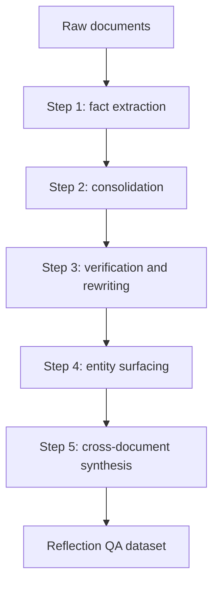

# MEMO Method Deep Dive

## 1. The Three Models

## GENERATOR Model

The GENERATOR model is used offline. It reads the target corpus and produces synthetic QA pairs called reflections.

In the experiments, the authors use Qwen2.5-32B-Instruct as the GENERATOR model, served with long-context support.

The GENERATOR is not used during final inference.

## MEMORY Model

The MEMORY model is the trained memory artifact. It is initialized from a smaller pretrained language model and supervised-fine-tuned on reflection QA pairs.

In the main experiments, the MEMORY model is Qwen2.5-14B-Instruct.

Important: at inference time, the MEMORY model does not see source documents. It answers only from its parameters.

## EXECUTIVE Model

The EXECUTIVE model is the user-facing reasoner. It receives the original user query, asks the MEMORY model sub-questions, tracks intermediate facts, and writes the final answer.

The EXECUTIVE model is frozen and can be black-box. The paper evaluates Qwen2.5-32B-Instruct and Gemini-3-Flash as EXECUTIVE models.

## 2. The Five-Step Reflection Data Pipeline

The pipeline turns a corpus into `Q_final`, a large QA dataset used to train the MEMORY model.



## Step 1: Fact Extraction

Each document is chunked if needed. For each chunk, the GENERATOR produces:

- **direct QA pairs**: facts explicitly stated in the text,
- **indirect QA pairs**: inferred or synthesized facts beyond direct surface wording.

Purpose: capture both recall and light reasoning.

Why it matters: if Step 1 misses information, later steps cannot recover it reliably.

## Step 2: Consolidation

The GENERATOR merges related QA pairs that share an entity, time period, event, or relationship.

Example pattern:

```text
Fact A: Person X founded company Y.
Fact B: Company Y later acquired company Z.
Merged QA: Which founder is connected to the company that acquired Z?
```

Purpose: train the MEMORY model on multi-fact compositions, not just isolated facts.

## Step 3: Verification and Rewriting

The GENERATOR checks whether each QA pair is self-contained.

Bad question:

```text
What did he do next?
```

Better question:

```text
What did [named person] do after [specific event]?
```

Pairs that remain ambiguous are discarded.

Purpose: make training examples answerable without source context.

Important nuance: Appendix E shows this step can hurt NarrativeQA because long narratives naturally contain pronouns and discourse references. Rewriting them may corrupt examples.

## Step 4: Entity Surfacing

For each named entity, the GENERATOR creates questions where attributes and relationships are given, and the answer is the entity identity.

This trains the MEMORY model to solve questions like:

```text
Which person is described by these clues?
```

Purpose: support entity identification during inference.

This also fights the **reversal curse**. A model may learn "Alice is Bob's mentor" but fail "Who is Bob's mentor?" Entity surfacing trains both directions more explicitly.

## Step 5: Cross-Document Synthesis

This is the most important step.

The GENERATOR receives groups of related documents or chunks and creates QA pairs that combine evidence across documents.

The paper names two types:

- **Converging clues**: multiple documents provide complementary facts about the same entity.
- **Parallel properties**: multiple entities share a role, attribute, or relationship that supports comparison.

Purpose: teach the MEMORY model relationships that normal retrieval systems often fail to assemble.

Appendix E shows Step 5 is critical. Removing it causes large accuracy collapse:

- NarrativeQA: 24.00% -> 6.37%
- MuSiQue: 42.90% -> 24.17%

## 3. MEMORY Model Training

The MEMORY model is trained by supervised fine-tuning on generated QA pairs.

The loss is next-token prediction over answer tokens only:

```text
L(phi) = - sum over (q_i, a_i) in Q_final
         sum over answer tokens
         log M_phi(a_i[t] | q_i, a_i[1:t-1])
```

Plain English:

The model sees a question and learns to generate the answer. It does not see the source document during training examples in the way a RAG reader would. The source corpus has already been transformed into QA reflections.

## 4. Why Answer-Only Loss Matters

The MEMORY model is optimized to output answers, not to reproduce questions or documents. This pushes it toward being a compact question-answering memory oracle.

That is different from continual pretraining, where a model predicts the next token of raw documents. The authors avoided continual pretraining because it can weaken instruction-following behavior.

## 5. Inference-Time Protocol

The EXECUTIVE model queries the MEMORY model in three stages.

## Stage 1: Grounding

The EXECUTIVE decomposes the user query into atomic sub-questions.

Purpose:

- probe relevant clues,
- gather initial context,
- avoid asking one huge vague question.

The MEMORY model answers each sub-question independently.

## Stage 2: Entity Identification

The EXECUTIVE uses grounding responses to identify candidate entities. It asks follow-up questions until it converges on one entity or runs out of budget.

Purpose:

- avoid entity drift,
- pin down who or what the question is about,
- use the entity-surfacing training examples from Step 4.

The implementation uses helper logic to track uncertain answers and choose fallback candidates.

## Stage 3: Answer Seeking and Synthesis

Once an entity is identified, the EXECUTIVE asks more targeted questions for supporting facts. Then it synthesizes the final answer.

The final answer depends on:

- original user query,
- Stage 1 MEMORY responses,
- identified entity,
- Stage 3 supporting facts.

## 6. Why Structured Multi-Turn Beats Single-Turn

Single-turn querying forces the EXECUTIVE model to guess all sub-questions before seeing any MEMORY answers.

Unstructured multi-turn improves on this, but lacks explicit state and entity control.

Structured multi-turn adds:

- grounding,
- candidate narrowing,
- state tracking,
- entity correction,
- final synthesis.

Appendix J shows the structured setup is usually stronger:

- BrowseComp-Plus: single-turn 32.56%, structured 54.22%
- MuSiQue: single-turn 37.57%, structured 48.30%
- NarrativeQA: structured needs more answer-seeking turns to beat unstructured because entity identification is less useful for narrative comprehension.

## 7. Continual Integration Through Model Merging

The paper also explores how to add new corpora over time.

For each corpus `D_i`:

1. Generate reflection QA pairs.
2. Fine-tune a MEMORY model from the same base.
3. Compute a task vector:

```text
tau_i = phi_i - phi_0
```

4. Merge task vectors into a single MEMORY model.

The merged model is queried in the same way as a normal MEMORY model.

## 8. Model Merging Methods Tested

The paper considers:

- Linear merging
- SLERP
- Task arithmetic
- TIES
- DARE
- DARE-TIES

The best reported merge is TIES with density `rho = 0.3`.

The result is a compute-accuracy trade-off:

- full retraining on NarrativeQA: about 72 GPU-hours cumulative,
- merging: about 48 GPU-hours cumulative,
- compute saved: about 33%,
- accuracy drops substantially.

## 9. Training Hyperparameters

Main training setup:

- optimizer: fused AdamW,
- learning rate: `2e-5`,
- epochs: 3,
- warmup ratio: 0.05,
- weight decay: 0.01,
- max sequence length: 8096,
- precision: BF16,
- attention: Flash Attention 2,
- gradient checkpointing enabled.

Generated QA pair counts:

- BrowseComp-Plus: 1,639,995 pairs,
- NarrativeQA: 1,276,676 pairs,
- MuSiQue: 664,762 pairs.

## 10. Cost Profile

The method is expensive upfront.

Approximate data generation cost:

- BrowseComp-Plus: 240 GPU-hours,
- NarrativeQA: 200 GPU-hours,
- MuSiQue: 150 GPU-hours.

Approximate Qwen2.5-14B MEMORY training cost:

- BrowseComp-Plus: 180 GPU-hours,
- NarrativeQA: 150 GPU-hours,
- MuSiQue: 90 GPU-hours.

This is the biggest practical barrier to MEMO.

