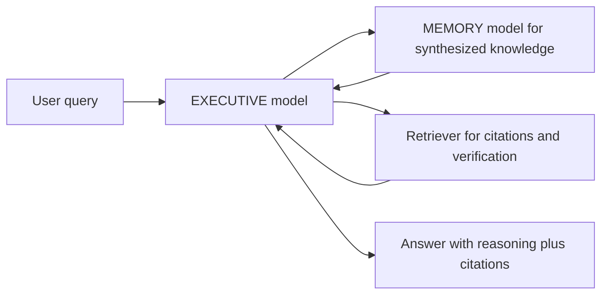

# Critical Analysis, Limitations, and Research Questions

## 1. What Is Strong About MEMO?

## Strong architectural separation

MEMO separates knowledge storage from reasoning:

- MEMORY model stores corpus-derived knowledge.
- EXECUTIVE model reasons and writes final answers.

This is a clean modular design. It lets the system upgrade the EXECUTIVE model without retraining the MEMORY model.

## Black-box compatibility

Because the MEMORY model communicates in natural language, the EXECUTIVE model can be proprietary. This is a real advantage over latent-memory and adapter methods that need internal model access.

## Better cross-document synthesis than simple retrieval

The data synthesis pipeline explicitly creates cross-document examples. This gives the MEMORY model training signal that a normal retriever does not have.

## Robustness to retrieval noise

Since MEMO does not retrieve raw chunks at inference time, irrelevant documents do not directly enter the EXECUTIVE model's context. The noise ablation supports this.

## Constant-size inference memory

Inference queries a fixed MEMORY model. The retrieval artifact does not grow with corpus size in the way a vector index or prompt context does.

## 2. Main Limitations

## High upfront cost

The method requires:

- LLM-based data generation,
- large synthetic QA datasets,
- supervised fine-tuning of MEMORY models.

The paper reports hundreds of GPU-hours for data generation and training. This makes MEMO hard to justify unless the corpus is valuable and queried often.

## Dependence on synthetic QA quality

The MEMORY model only learns what the reflection pipeline captures. If the GENERATOR model misses, distorts, or hallucinates facts, the MEMORY model inherits those errors.

This is the deepest risk in MEMO:

```text
Bad reflections -> bad memory.
```

## Harder source attribution

RAG can return citations and exact chunks. MEMO answers from parameters, so exact provenance is less direct.

For legal, medical, academic, or audit-heavy applications, this is a serious limitation unless the system adds source-aware reflection metadata or post-hoc verification.

## Capacity limits

A fixed-size MEMORY model has finite capacity. The paper admits that sufficiently large or information-dense corpora may exceed what the model can internalize.

This raises open questions:

- How large can the corpus be before accuracy collapses?
- Should MEMORY model size scale linearly with corpus size?
- Can multiple MEMORY models be routed dynamically?

## Expensive cross-document synthesis

Step 5 scales badly. The paper describes complexity roughly as:

```text
O(k * C^2 * Q^2)
```

where:

- `k` is number of groups,
- `C` is chunks per group,
- `Q` is average QA pairs per chunk.

This is a major bottleneck for large corpora.

## The inference protocol is hand-designed

The structured multi-turn protocol works, but it includes task-specific choices:

- stage budgets,
- temperatures,
- entity tracking,
- fallback candidate selection,
- pivot correction.

These are not yet systematically optimized.

## 3. Methodological Concerns

## Benchmark scale

The paper evaluates on meaningful benchmarks, but the selected subsets are not enormous:

- BrowseComp-Plus: 300 questions,
- NarrativeQA: 293 questions,
- MuSiQue: 1,000 questions.

The method is expensive, so larger evaluations would be valuable.

## Perfect Retrieval headroom remains large

MEMO does not close the gap to Perfect Retrieval:

- BrowseComp-Plus with Qwen: MEMO 54.22 vs Perfect Retrieval 79.67.
- NarrativeQA with Qwen: MEMO 26.85 vs Perfect Retrieval 51.42.
- MuSiQue with Qwen: MEMO 48.30 vs Perfect Retrieval 62.83.

This means MEMO is useful, but not near the upper bound.

## Mixed evidence for model merging

Model merging saves compute but causes large accuracy drops. It is promising as a research direction, not yet a clear practical replacement for retraining.

There also appears to be a table-text inconsistency: the paper says the merged MEMORY model beats every retrieval baseline on NarrativeQA, but the Qwen EXECUTIVE numbers in Table 2 and Table 6 suggest otherwise.

## NarrativeQA reveals protocol mismatch

Entity identification helps BrowseComp-Plus and MuSiQue more than NarrativeQA. This means the protocol may need to be domain-adaptive.

For narratives, entity pinning may waste turns that should be used for broader thematic or event reasoning.

## 4. When Would I Use MEMO?

Use MEMO when:

- the corpus is stable,
- many queries will be asked over time,
- cross-document synthesis matters,
- RAG retrieval noise is a known problem,
- the EXECUTIVE model cannot be fine-tuned,
- inference latency and prompt length matter.

Examples:

- enterprise knowledge base used repeatedly,
- legal archive with repeated analytical queries,
- long research corpus where cross-paper relationships matter,
- internal technical documentation with many linked concepts.

## 5. When Would I Prefer RAG?

Prefer RAG when:

- corpus changes frequently,
- exact citations are mandatory,
- the question is usually simple lookup,
- budget does not allow training,
- transparency matters more than synthesis,
- you need to debug or inspect retrieved evidence.

RAG is operationally simpler and easier to audit.

## 6. Best Way to Explain MEMO in an Interview

Short answer:

MEMO is a memory architecture for LLMs where a separate MEMORY model is fine-tuned on synthetic reflection QA pairs derived from a target corpus. A frozen EXECUTIVE model queries that MEMORY model through a structured multi-turn protocol, allowing black-box LLMs to use updated knowledge without retrieving raw documents or modifying their weights.

Slightly deeper answer:

The key innovation is that MEMO converts a corpus into compositional QA reflections before training. These reflections include direct facts, inferred facts, entity-surfacing questions, and cross-document synthesis questions. This teaches the MEMORY model relationships that RAG might fail to retrieve in one context window. At inference, the EXECUTIVE model decomposes user queries into targeted sub-questions, uses the MEMORY model as an oracle, and synthesizes the final response.

Critical answer:

MEMO shifts work from inference-time retrieval to offline synthesis and fine-tuning. That improves robustness to retrieval noise and allows constant-size memory at inference, but it introduces high upfront cost, dependence on synthetic data quality, weaker provenance, and unknown capacity limits.

## 7. Research Questions to Ask

1. Can MEMO support exact source citations without reintroducing RAG?
2. How does MEMORY capacity scale with corpus size and factual density?
3. Can the reflection pipeline be trained or optimized automatically rather than prompt-engineered?
4. Can Step 5 cross-document synthesis be made sub-quadratic?
5. Would a hybrid MEMO + RAG system outperform both?
6. Can the EXECUTIVE learn the multi-turn protocol instead of using fixed prompts?
7. How often must MEMORY be retrained as the corpus changes?
8. Can model merging be improved enough to make continual updates practical?
9. How robust is MEMO to hallucinated reflections?
10. Does MEMO preserve rare facts, or mainly compress high-frequency relationships?

## 8. Possible Hybrid Extension

A practical system might combine MEMO and RAG:



This could use MEMO for cross-document reasoning and RAG for evidence verification.

## 9. Bottom-Line Evaluation

MEMO is a strong research idea because it reframes memory as a model-level artifact while keeping the user-facing LLM frozen. Its biggest contribution is the combination of:

- reflection-based corpus synthesis,
- parametric MEMORY model,
- black-box natural-language interface,
- structured multi-turn querying.

Its biggest unresolved challenge is practical deployment cost and trustworthiness.

